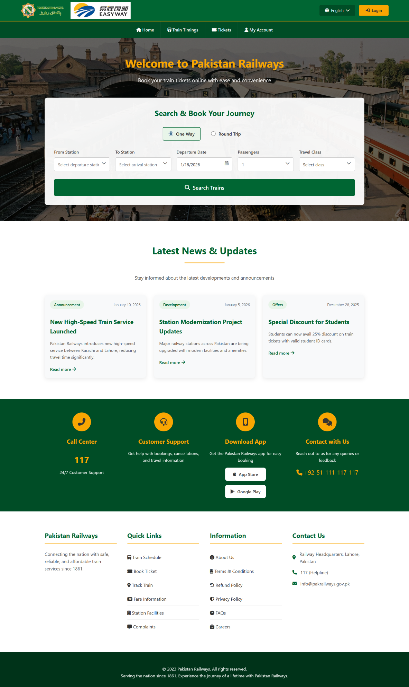
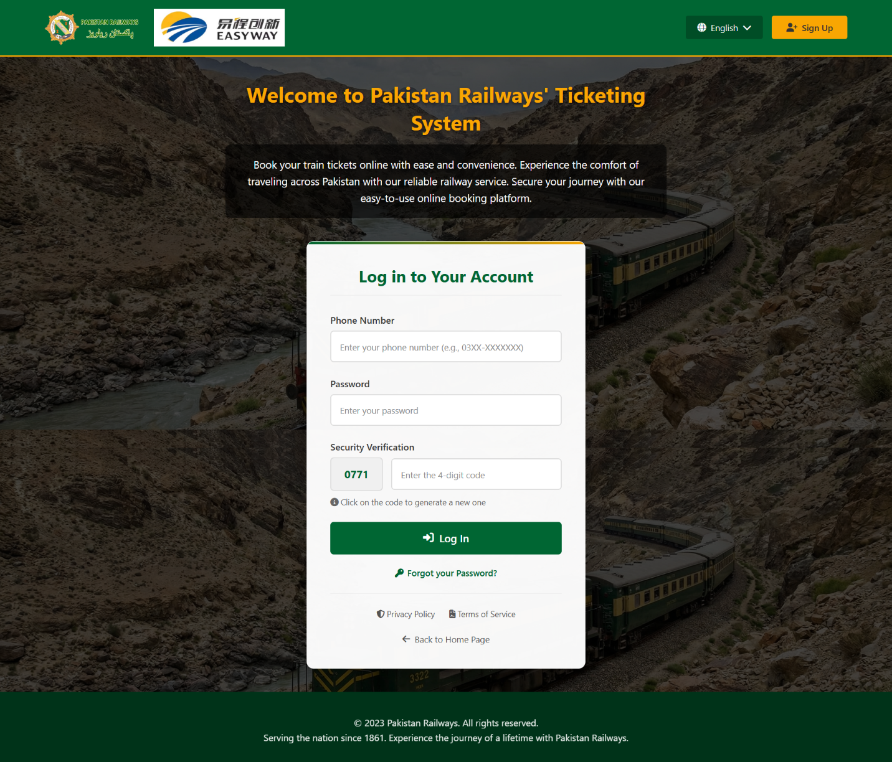
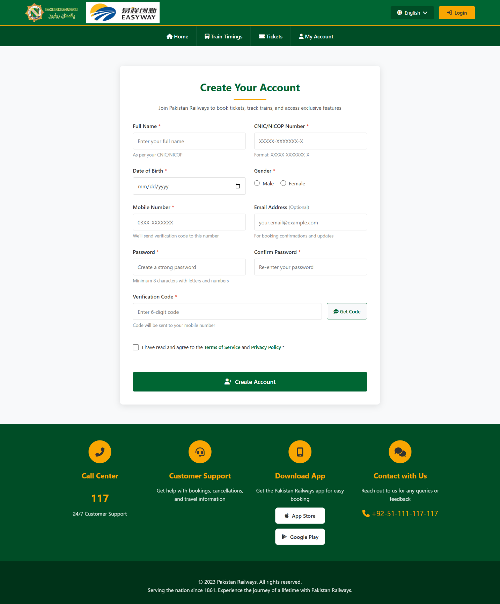
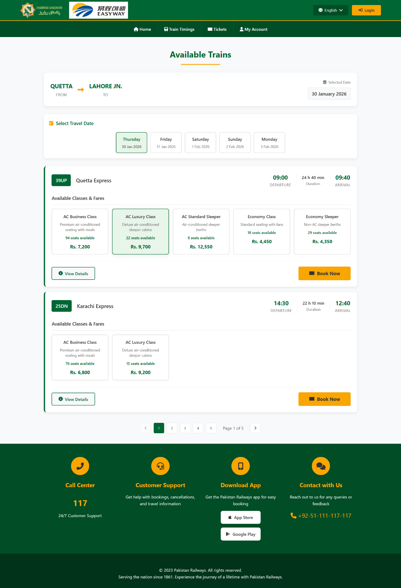

> 🚆 Pakistan Railways UX Redesign
### Usability Evaluation & Figma Redesign of RABTA (pakrailways.gov.pk)



---

## 📌 Project Overview

RABTA is the official web-based e-ticketing portal of Pakistan Railways — a national public 
service used by millions of passengers across 479 stations, from Karachi to Peshawar.

Despite its scale and importance, the platform contained several critical usability violations 
that made it frustrating and inaccessible for everyday users.

This project presents a **structured usability evaluation** followed by a **complete Figma 
redesign**, conducted as part of our Human-Computer Interaction (HCI) course.

🔗 **Original Website:** [www.pakrailways.gov.pk](http://www.pakrailways.gov.pk)  
📄 **Full Report:** [RABTA-Usability-Report.pdf](RABTA-Usability-Report.pdf)

---

## 🎯 Objectives

- Evaluate accessibility for elderly and low-literacy users
- Identify error prevention failures in critical flows (signup, login, booking)
- Assess clarity of navigation and system language
- Redesign identified problem areas using modern UX principles

---

## 👤 Target Users

- **Age:** 18 to 65+
- **Technical Skill:** Beginner to intermediate
- **Devices:** Desktop and mobile web browsers
- **Language:** Urdu and regional language speakers (Punjabi, Sindhi, Pashto)

---

## 🧪 Methodology

**Method:** Heuristic Evaluation  
**Framework:** Nielsen's 10 Usability Heuristics  
**Tool:** Figma (Lo-Fi Wireframes → Hi-Fi Prototypes)  
**Environment:** Windows 10/11, Google Chrome

### Tasks Evaluated
1. Account Creation (Signup & Email Verification)
2. User Login
3. Train Search & Booking Exploration

---

## ❗ Usability Issues Identified (8 Critical Issues)

| # | Issue | Heuristic Violated | Severity |
|---|---|---|---|
| 1 | Login fields invisible — blended into background | Visibility of System Status | High |
| 2 | Cryptic codes (ACSB, ACLZ, PC) with no explanation | Match Between System & Real World | High |
| 3 | Verification system rejected valid signup codes | Error Prevention | Critical |
| 4 | Vague navigation labels ("My", "Order") | Recognition Rather Than Recall | Medium |
| 5 | No support for Punjabi, Sindhi, or Pashto | Match Between System & Real World | High |
| 6 | "Book Now" button hidden off-screen | Flexibility & Efficiency of Use | High |
| 7 | "Emile Address" spelling error on signup form | Aesthetic & Minimalist Design | Medium |
| 8 | Terms of Service & Privacy Policy in wrong location | Consistency & Standards | Low |

---

## 🎨 Redesigned Screens

### 🏠 Home Page
|  |

**Issues Fixed:** Poor visual hierarchy · Ambiguous navigation · No language support · Misplaced legal links

---

### 🔐 Login Page
|  |

**Issues Fixed:** Invisible input fields · Poor contrast · Misplaced Privacy Policy & Terms links

---

### 📝 Signup Page
|  |

**Issues Fixed:** Broken verification flow · "Emile Address" typo · No real-time validation

---

### 🚂 Train Timings Page
|  |

**Issues Fixed:** Cryptic class codes · Hidden booking button · No clear seat availability display

---

## ✨ Key Improvements Summary

| Usability Principle | Original Problem | Our Fix |
|---|---|---|
| Visibility of System Status | Login fields blended into background | High-contrast form with clear borders |
| Match with Real World | ACSB, ACLZ codes confused users | Replaced with "AC Business Class", "Economy Sleeper" |
| Error Prevention | Verification rejected valid codes | Clear flow with countdown timer |
| Recognition over Recall | "My" and "Order" navigation labels | Descriptive labels with icons |
| Consistency & Standards | Legal links buried randomly | Standardized footer across all pages |
| Flexibility & Efficiency | Booking button off-screen | Always-visible "Book Now" button |
| Aesthetic & Minimalist Design | Cluttered layouts, spelling errors | Clean layout, corrected copy |
| Help & Documentation | No guidance for first-time users | Tooltips and field hints added |

---

## 📂 Project Structure
```
pakistan-railways-ux-redesign/
├── images/              # Hi-Fi redesign screenshots 
├── RABTA-Usability-Report.pdf   # Full project report with screenshots 
└── README.md            # This file
```

---

## 💡 Key Takeaway

> *When a public platform is hard to use, real people miss trains.*  
> Good design is not a luxury — for a national service used by millions, it is a responsibility.

---
